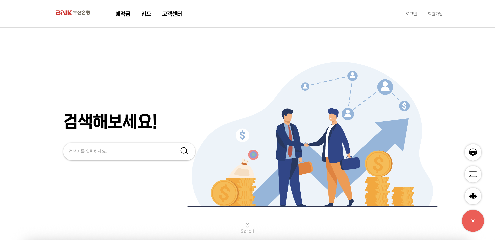
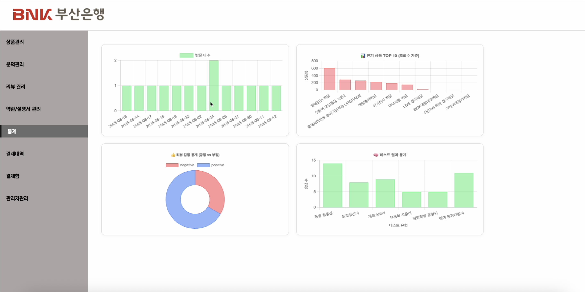
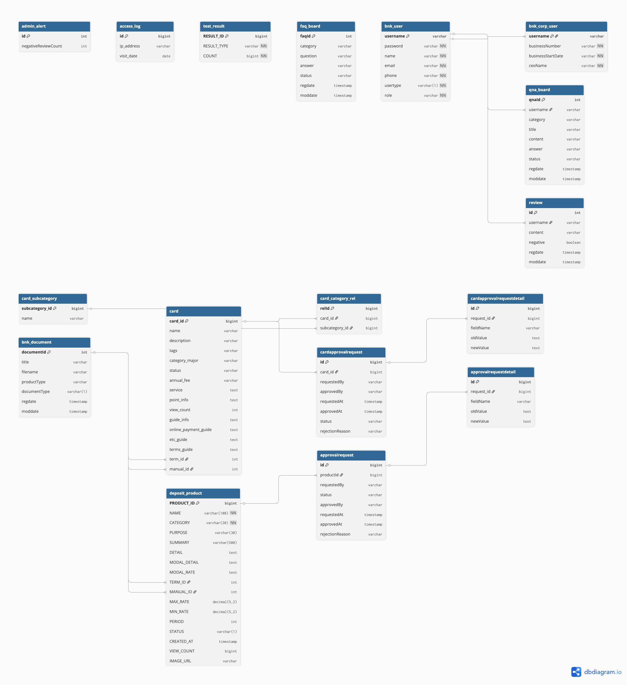
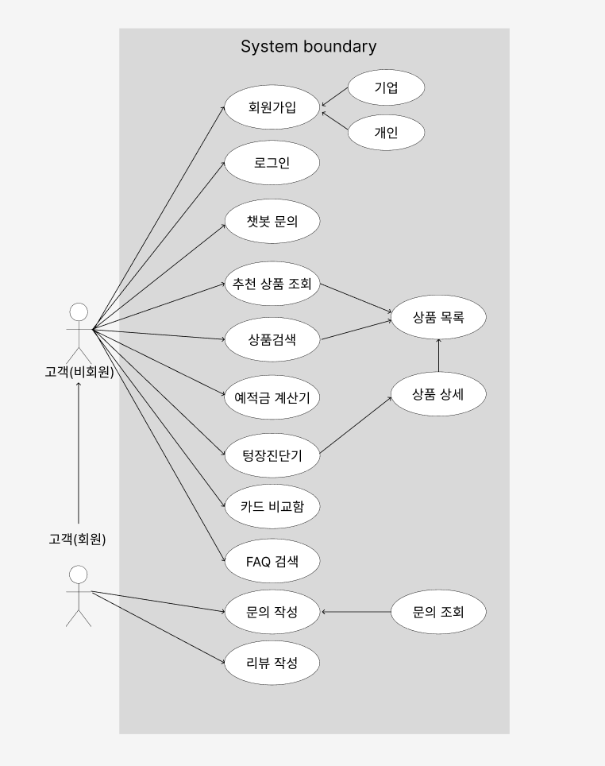
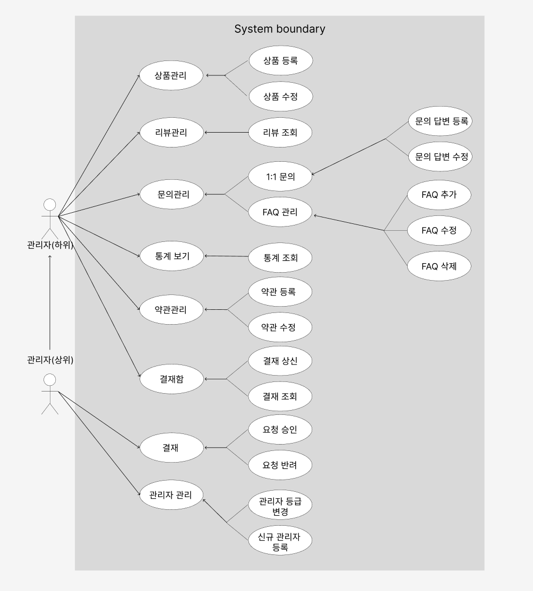

# BNK Reframe
### Open AI를 활용한 은행상품판매를 위한 상품관리페이지 및 고객상품 안내페이지 개발

- 본 프로젝트는 **부산은행 KDT 과정에서 진행한 1차 프로젝트**입니다.
- 유형: 팀 프로젝트(5인)
- 기간: 2025.06.24 ~ 2025.07.24

## 📌 프로젝트 개요
본 프로젝트는 금융 상품 탐색 편의성을 높이기 위해, 사용자가 다양한 금융 상품을 쉽게 비교하고 자신의 상황과 목적에 맞는 상품을 직관적으로 찾을 수 있도록 설계된 웹사이트입니다.

### 사용자
- 키워드 검색과 추천 상품 목록을 통해 예·적금 및 카드 상품을 빠르게 탐색
- 상품 요약 정보를 통해 직관적인 상품 이해 가능
- 마우스 이벤트, 카드 슬라이더, 애니메이션 이미지 등 시각적 효과로 흥미 유도
  
### 관리자
- 상품 등록 및 수정 요청 시 결재 상신 → 승인·반려 절차를 통해 체계적으로 관리
- 사용자 데이터 수집 및 분석을 기반으로 상품 개발·마케팅 전략 수립 가능
 
## 🤔 기획의도
- 사용자가 간편한 검색과 직관적인 UI를 통해 원하는 상품을 쉽게 탐색할 수 있도록 기획
- 관리자가 등록·수정·결재·승인 절차를 효율적으로 처리할 수 있는 시스템 설계
- 관리자에게는 통계 데이터 기반 의사결정 지원, 사용자에게는 재미와 몰입감을 주는 인터랙션 제공
- 결과적으로 사용자 경험(UX) 향상과 업무 효율성 강화를 동시에 달성하는 것을 목표로 함

## 👥 팀원 소개
| 담당자 | 역할 | 주요 구현 내용 |
| --- | --- | --- |
| **윤다영(팀장)** | 로그인/회원가입, 메인·약관 관리 | 사용자(개인, 기업) 회원가입/로그인, 금융상품 메인 페이지, 사이드 퀵 메뉴<br>약관·상품 설명서 관리(관리자) |
| **차수현** | 예·적금 관리 | 예·적금 메인 페이지/목록/상세<br>예·적금 카테고리 필터링/검색(키워드, 자동완성, 정렬, 추천 키워드) |
| **박정원** | 카드·텅장진단기 | 카드 메인 페이지, 카드 대분류/키워드 검색/소분류 필터링/다중 검색<br>카드 비교함, 텅장진단기 페이지/결과 |
| **오건윤** | 리뷰·고객센터·OpenAI | 리뷰/FAQ/1:1 문의, 챗봇 문의(Open AI)<br>리뷰 분석(관리자), FAQ·1:1 문의 관리(관리자) |
| **김법진** | 관리자 기능 | 관리자 로그인<br>예·적금·카드 등록/수정/조회(카테고리별), 결재 관리, 통계 관리, 관리자 관리 |

## 🛠️ 기술 스택
- **Back-end**: Spring Boot(Java), Spring Security
- **Front-end**: Thymeleaf, HTML/CSS, JavaScript
- **Database**: Oracle DB, Spring Data JPA
- **Communication & Tools**: Notion, GitHub, GitHub Desktop

## ✨ 주요 기능
### 사용자
- 금융상품 **검색/추천/자동완성** 기능  
- 예·적금 상품 탐색 및 **이자 계산기** 제공  
- 카드 상품 비교, 필터링, 키워드 검색  
- 리뷰 작성, FAQ/1:1 문의, AI 챗봇 상담
- **텅장진단기**(소비 성향 테스트)

### 관리자
- 상품 관리 (등록, 수정, 상태 변경)  
- 약관 및 상품 설명서 업로드 (PDF → JPG 변환 지원)  
- FAQ 및 리뷰 관리 (AI 기반 긍/부정 판별)  
- 결재 프로세스 (상품 등록/수정 시 상위 관리자 승인)  
- 방문자 통계, 리뷰 분석, 인기 상품 Top 10

## 🖥️ 주요 화면
### 사용자
| 메인화면 | 예적금 메인 | 카드 메인 |
| --- | --- | --- |
|  |  |  |

### 관리자
| 관리자 로그인 | 관리자 메인(상품관리) | 통계 |
| --- | --- | --- |
|  |  |  |

## 📹 시연 영상
- 사용자 페이지: [https://youtu.be/tXddm06Cv08](https://youtu.be/tXddm06Cv08)
  
- 관리자 페이지: [https://youtu.be/1cTyh9qARng](https://youtu.be/1cTyh9qARng)


## 📚 DB 설계


> ERD 이미지 : [docs/bnk1_erd.png](docs/bnk1_erd.png)

## 📚 유스케이스
### 사용자


> 사용자 유즈케이스 원본: [docs/bnk1_유즈케이스_사용자.png](docs/bnk1_유즈케이스_사용자.png)

### 관리자


> 관리자 유즈케이스 원본: [docs/bnk1_유즈케이스_관리자.png](docs/bnk1_유즈케이스_관리자.png)

## 📊 기대 효과
- **고객 만족도 향상** : 빠르고 정확한 AI 응답으로 문의 해결 속도 증가  
- **상담 효율화** : 챗봇이 반복 업무를 처리하여 직원 부담 감소  
- **데이터 기반 개선** : 리뷰·상담 데이터 분석을 통한 상품 개선 인사이트 확보  
- **세대 간 디지털 격차 해소** : 전 연령층이 쉽게 접근 가능한 UI 제공

## 📄 기타 문서
- [요구사항 정의서](docs/bnk1_요구사항정의서.xlsx)
- [업무분장표](docs/bnk1_업무분장표.xlsx)
- [와이어프레임(사용자)](docs/bnk1_사용자페이지.pdf)
- [와이어프레임(관리자)](docs/bnk1_관리자페이지.pdf)

## ⚙️ 환경 설정
> 아래 내용을 참고하여 `src/main/resources/application.properties` 파일을 생성한 후 실행해주세요.

```properties
spring.application.name=[your_project_name]

server.port=8090

# Oracle DB 설정
spring.datasource.driver-class-name=oracle.jdbc.OracleDriver
spring.datasource.url=jdbc:oracle:thin:@localhost:1521/[데이터베이스 명]
spring.datasource.username=[데이터베이스 계정이름]
spring.datasource.password=[데이터베이스 비밀번호]

spring.jpa.hibernate.ddl-auto=update
spring.jpa.properties.hibernate.format_sql=true
spring.jpa.properties.hibernate.dialect=org.hibernate.dialect.OracleDialect
spring.jpa.show-sql=true

# SMTP 기본 설정
spring.mail.host=smtp.gmail.com
spring.mail.port=587
spring.mail.username=[이메일 계정 주소]
spring.mail.password=[앱 비밀번호/SMTP 인증 비밀번호]

# SMTP 인증 및 보안 
spring.mail.properties.mail.smtp.auth=true
spring.mail.properties.mail.smtp.starttls.enable=true
spring.mail.properties.mail.smtp.starttls.required=true

spring.servlet.multipart.max-file-size=10MB
spring.servlet.multipart.max-request-size=10MB

# 공공데이터포털 API 키(국세청_사업자등록정보 진위확인 및 상태조회 서비스)
public.api.biz.service-key=[국세청_사업자등록정보 진위확인 및 상태조회 서비스 키]

# OpenAI API 키
openai.api.key=[OpenAI API 키]

# reCAPTCHA secret key
google.recaptcha.secret=[구글 reCAPTCHA 시크릿 키]

```

> 사용자 페이지, 관리자 페이지 접속 링크는 아래를 참고해주세요. 
- 사용자 페이지: [http://localhost:8090](http://localhost:8090)
- 관리자 페이지: [http://localhost:8090/admin/signin-form](http://localhost:8090/admin/signin-form)
